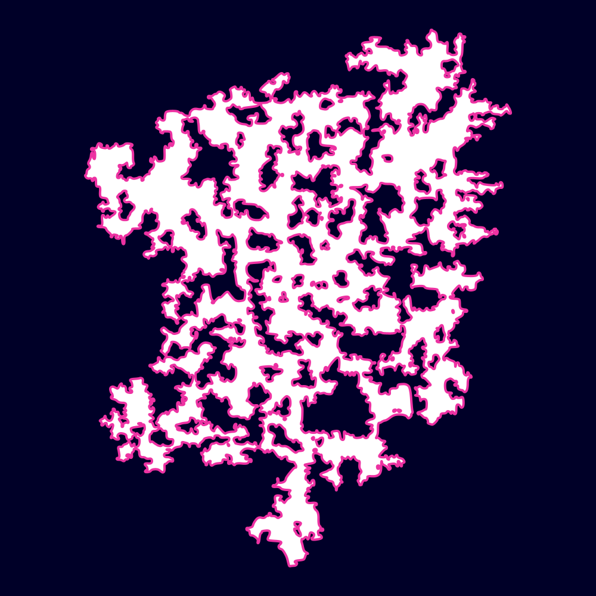
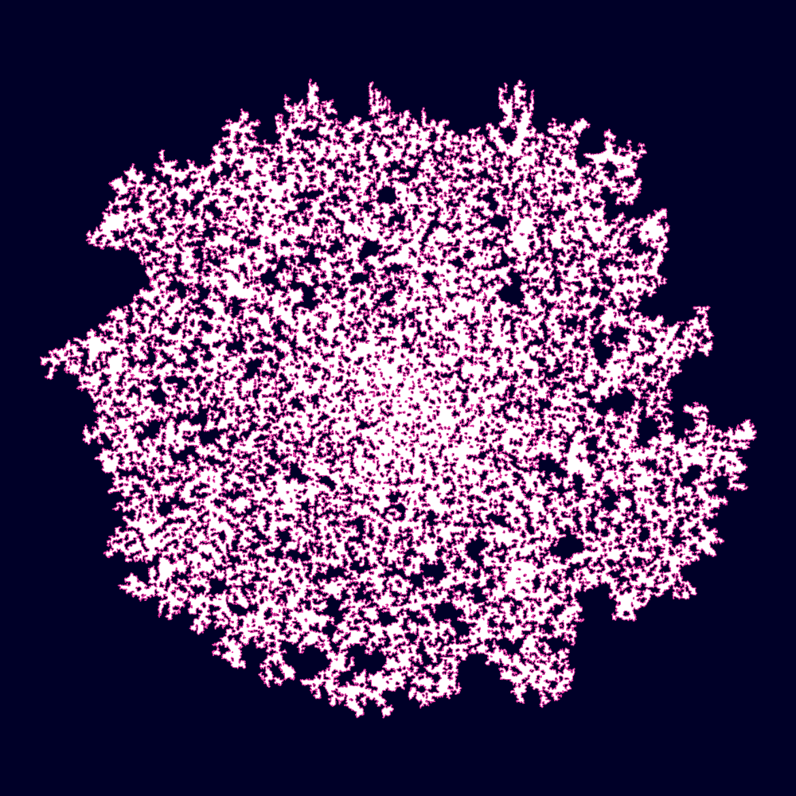

# SRPG – Super Random Polygon Generator

SRPG is a library that generates well-formed random polygons using a regular grid consisting of square cells.

It starts with axis & grid-aligned basic rectangular shapes, but can systematically manipulate them through repeated corner-cutting and perturbations to create a variety of polygonal and curve-like shapes, both on the grid and with offset/rotated orientations.

This library is based on *Martin Held*'s C [implementation](https://github.com/cgalab/genpoly-srpg).

## Usage
SRPG is available as Maven/Gradle artifact via [Jitpack](https://jitpack.io/#micycle1/SRPG).

## Argument Illustrations

SRPG accepts a variety of input arguments that affect shape geometry, providing a good level of customisation over the output. The following illustrations provide an idea of how each argument visually affects the random polygon:

<table>
  <tr>
    <td align="center" valign="center"><b>Hierarchy</td>
    <td align="center" valign="center"><b>Diagonal</td>
    <td align="center" valign="center"><b>Perturb+align</td>
    <td align="center" valign="center"><b>Smooth</td>
  </tr>
  <tr>
    <td valign="top" width="25%"></td>
    <td valign="top" width="25%"></td>
    <td valign="top" width="25%"></td>
    <td valign="top" width="25%"></td>
  </tr>
</table>

### Grid size (nX, nY)

<table>
  <tr>
    <td align="center" valign="center"><b>5x5</td>
    <td align="center" valign="center"><b>10x10</td>
    <td align="center" valign="center"><b>100x100</td>
    <td align="center" valign="center"><b>500x500</td>
  </tr>
  <tr>
    <td valign="top" width="25%"></td>
    <td valign="top" width="25%"></td>
    <td valign="top" width="25%"></td>
    <td valign="top" width="25%"></td>
  </tr>
</table>
